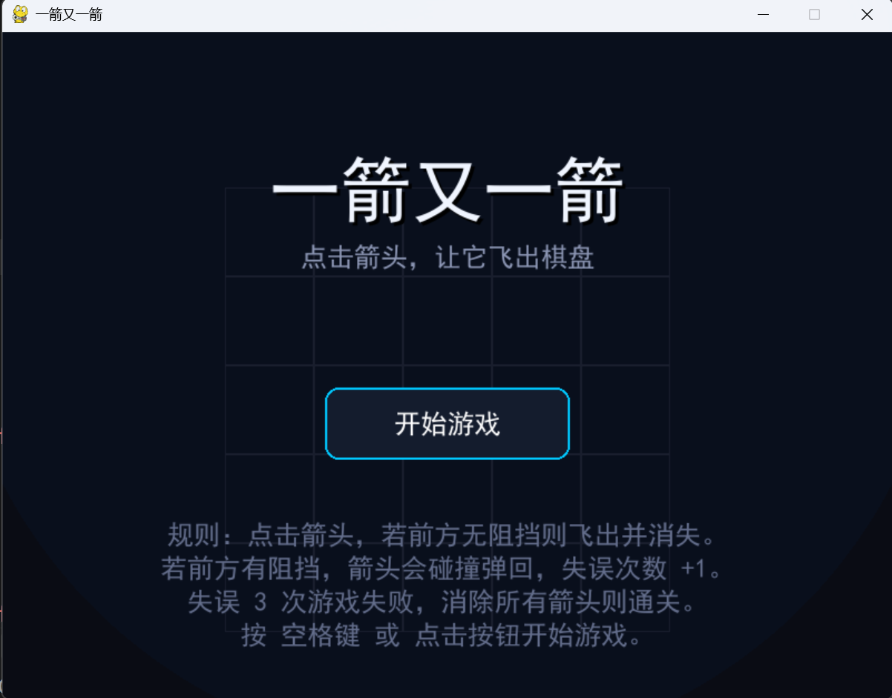

# Something about the Reposity
1. **项目名称**  ：一箭又一箭（山寨版中的山寨版）
2. **游戏简介** ：~~有了这种项目名称后还需要什么游戏简介吗？~~ 火遍神州大地的游戏，大家快来玩呀
3. **开发环境** ：Python 3.12.6  pygame-2.6.1 git version 2.55.0.windows.5
4. **安装和运行方法** ： 进入右栏的Reslease，下载后双击即可运行，无需安装 Python 和 Pygame。
6. **游戏操作说明** ：（玩游戏的时候看过这种东西吗）

 ----------------------------------------------deepseek生成中---------------------------------------------
## 游戏操作说明
### 游戏目标
在失误次数耗尽前，消除棋盘上的所有箭头。
### 基本操作
- **开始游戏**：在开始界面按 `空格键` 或点击鼠标左键。
- **消除箭头**：鼠标左键点击棋盘上的任意箭头。程序会自动判断该箭头前方（同一行或同一列）是否有其他箭头阻挡。
- **飞出棋盘**：若前方无阻挡，箭头会飞出棋盘并消失。
- **失误判定**：若前方有阻挡，箭头无法消除，会晃动提示，并且失误次数加 1。
- **重新开始**：游戏界面右上角有一个“重新开始”按钮，点击后当前关卡将恢复初始布局，失误次数清零。
- **通关与失败**：
  - 成功消除本关全部箭头，显示“通关！”，点击鼠标进入下一关。
  - 失误次数达到 3 次，显示“失败！”，点击鼠标重新开始当前关卡。

